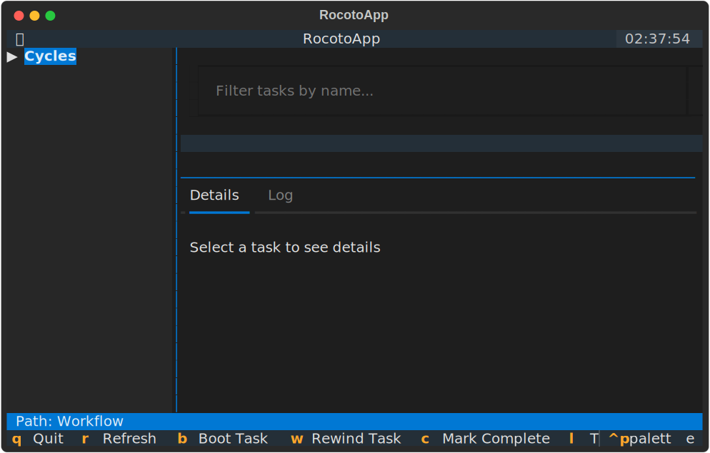

# Tutorial: Monitoring Your First Workflow

This tutorial will walk you through a typical session using RocotoViewer to monitor a running workflow.

## Scenario

Suppose you have a workflow named `TutorialWorkflow` that has been running for several hours. You want to check the status of the `12Z` cycle and see why a specific task failed.

## Step 1: Launch RocotoViewer

Open your terminal and run RocotoViewer pointing to your workflow files:

```bash
rocotoviewer -w example_workflow.xml -d example_workflow.db
```

When the application starts, you will see the **Cycle Tree** on the left with all cycles initially collapsed.



## Step 2: Navigate and Expand Cycles

The **Cycle Tree** allows you to navigate the hierarchy of your workflow.

*   **Keyboard**: Use the `Up` and `Down` arrow keys to highlight a cycle. Press `Enter` to **expand** or **collapse** the selected cycle.
*   **Mouse**: Click on a cycle name or the expansion icon next to it to toggle its state.

Expand the `202310271200` (the 12Z cycle). You will see the tasks associated with that cycle appear underneath it.

RocotoViewer uses **icons** and **colors** to help you quickly identify task states:
*   ✅ **SUCCEEDED**: Task finished successfully.
*   🏃 **RUNNING**: Task is currently executing.
*   💀 **DEAD**: Task failed and will not be retried automatically.
*   🕒 **QUEUED**: Task is waiting for resources in the batch system.
*   ⌛ **WAITING / PENDING**: Task is waiting for dependencies to be met.


## Step 3: Filter for the Failed Task

In the main view, you see a list of tasks. You are looking for a task named `run_model_A`.

1.  Press `Tab` to move focus to the **Filter Input** box at the top (or click it with your mouse).
2.  Type `model`.


The **Cycle Tree** will now only show tasks containing "model" in their name, making it easier to find what you need across all cycles.

## Step 4: Inspect Task Details

Find the `run_model_A` task for the `202310271200` cycle in the tree. You notice its state is `DEAD`.

*   **Select**: Click on the task in the tree or use arrow keys to highlight it.
*   **Observe**: The **Selected Task Status** table and the **Details** tab will populate with information specific to this task instance.

The Details Panel shows the **Resolved Command** and **Log Paths** (Stdout/Stderr). RocotoViewer automatically resolves `<cyclestr>` tags based on the selected cycle.

## Step 5: View Live Logs

If a task is running or has failed, you often want to see the output.

1.  With the task selected, press `l` to switch to the **Log** tab.
2.  The tab will show a live `tail` of the log file.


You can see the "Segmentation fault" error right in the TUI!
*   Press `f` to toggle **Log Follow** mode (autoscroll to the bottom).

## Step 6: Explore Complex Dependencies

RocotoViewer helps you visualize complex dependency logic. In our example, the `verify` task has a multi-part dependency:

```xml
<task name="verify" cycledefs="standard">
  <dependency>
    <and>
      <taskdep task="archive"/>
      <!-- Depends on archive from the PREVIOUS cycle -->
      <taskdep task="archive">
        <cycleoffset>-12:00:00</cycleoffset>
      </taskdep>
    </and>
  </dependency>
</task>
```

When you select the `verify` task, the **Details Panel** lists these dependencies, helping you understand why a task might be stuck in a `PENDING` state.

## Step 7: TUI Navigation Cheat Sheet

| Key | Action | Context |
| :--- | :--- | :--- |
| `Up/Down` | Move Selection | Cycle Tree |
| `Enter` | Expand/Collapse or Select | Cycle Tree |
| `Tab` | Switch Focus | Between Tree, Filter, and Tabs |
| `l` | Toggle between Details/Log | Global |
| `f` | Toggle Log Follow | While Log tab is active |
| `r` | Manual Refresh | Global |
| `q` | Quit | Global |

## Step 8: Rewind and Monitor

After fixing the underlying issue (e.g., fixing a data issue that caused the Segfault), you can signal Rocoto to retry.

With `run_model_A` selected, press `w` to "Rewind" the task. RocotoViewer will send the command to Rocoto. Wait for the auto-refresh (every 30s) or press `r` to see the state change to `QUEUED` or `RUNNING`.

*(Note: In this demo version, actions show a notification in the UI).*
