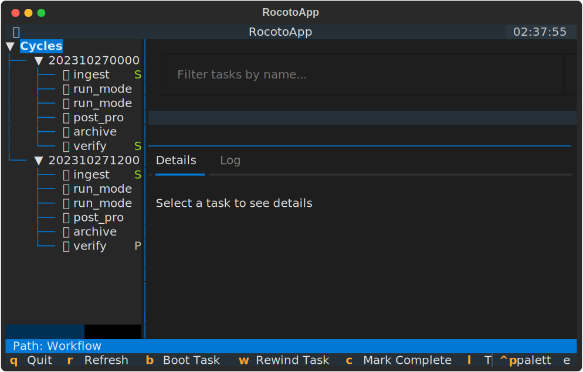
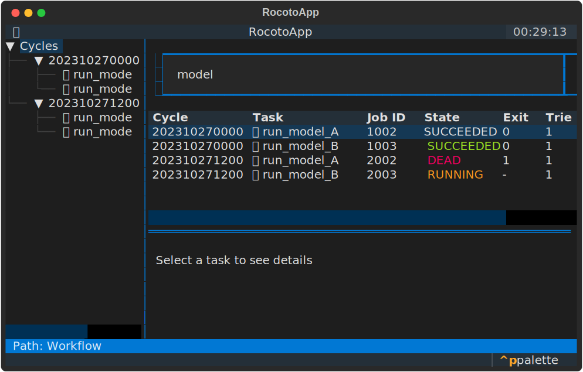
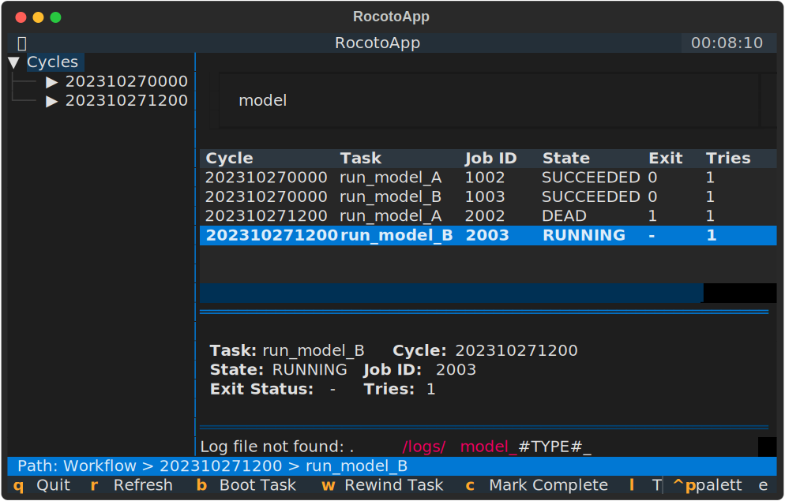

# Tutorial: Monitoring Your First Workflow

This tutorial will walk you through a typical session using RocotoViewer to monitor a running workflow.

## Scenario

Suppose you have a workflow named `TutorialWorkflow` that has been running for several hours. You want to check the status of the `12Z` cycle and see why a specific task failed.

## Step 1: Launch RocotoViewer

Open your terminal and run RocotoViewer pointing to your workflow files:

```bash
rocotoviewer -w example_workflow.xml -d example_workflow.db
```



## Step 2: Navigate to the Cycle

In the sidebar on the left, you will see a list of cycles. Use your arrow keys or mouse to find the `202310271200` (the 12Z cycle) and select it (or press Enter) to expand it.

The main table view will show all tasks for all cycles, but the tree on the left allows you to quickly see the hierarchy.

## Step 3: Filter for the Failed Task

In the main view, you see a list of tasks. You are looking for a task named `run_model_A`.
Click on the "Filter tasks by name..." input box at the top and type `model`.



The table will now only show tasks containing "model".

## Step 4: Inspect the Failure

Find the `run_model_A` task for the `202310271200` cycle in the table. You notice its state is `DEAD` and the exit status is `1`.
Click on that row to select it.

## Step 5: Check the Logs

Look at the Details Panel at the bottom. It shows the resolved path for `Stdout` and `Stderr`, as well as the command and dependencies.

Press `l` to toggle the **Log Panel**. If the log file exists, RocotoViewer will tail it in real-time.



You can see the "Segmentation fault" error right in the TUI!

## Step 6: Advanced Dependencies

RocotoViewer handles complex dependencies. In this example, the `post_process` task depends on both `run_model_A` and `run_model_B` being successful.

```xml
<task name="post_process" cycledefs="standard">
  <dependency>
    <and>
      <taskdep task="run_model_A"/>
      <taskdep task="run_model_B"/>
    </and>
  </dependency>
</task>
```

The Details Panel will show these dependencies clearly when the task is selected.

## Step 7: Rewind and Retry

After fixing the underlying issue, you want to retry the task.
With the `run_model_A` task still selected, press `w` to "Rewind" the task.

*(Note: Currently, Rocoto actions are placeholders and will show a notification in the UI).*

## Step 8: Refresh and Monitor

Press `r` to manually refresh and verify that the task state has changed (e.g., to `QUEUED` or `RUNNING`).
Alternatively, just wait for the auto-refresh to kick in!
